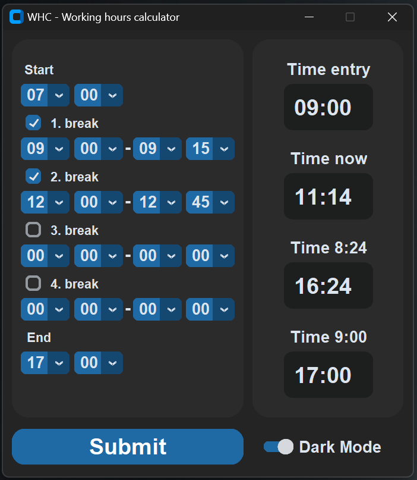
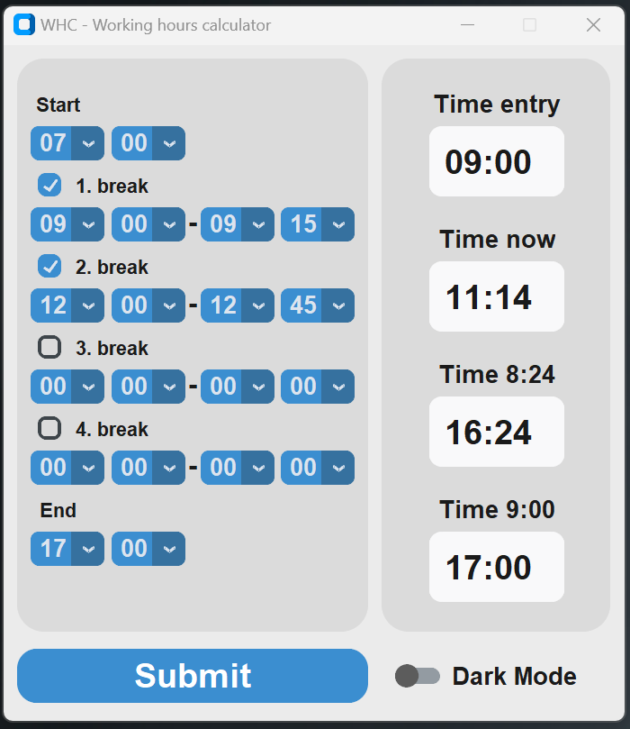
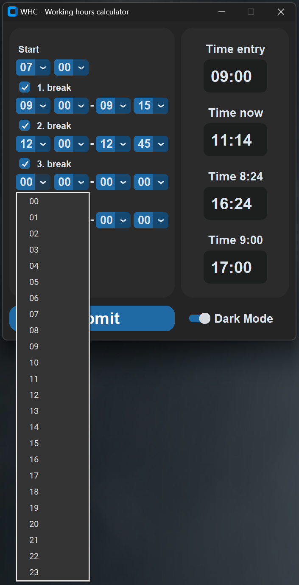

# WHC - Working Hours Calculator

---

## Overview

The **WHC (Working Hours Calculator)** is a desktop application built using the `customtkinter` library. It allows users to input and calculate their working hours, including breaks. The app features a graphical user interface (GUI) for ease of use and toggles between Dark and Light modes.

---

## Features

- **Responsive GUI**: The application uses the `customtkinter` library to create a sleek and modern user interface.
- **Time Entry**: Users can enter times such as start, breaks, and end times of their working day.
- **Dark Mode Toggle**: A switch is provided to toggle between Dark Mode and Light Mode.
- **Submit Button**: The `Submit` button processes the data and performs the calculation for working hours.

---

## Components
The main window (`Root`) serves as the base for the application:
- **Size**: 460x500 pixels.
- **Title**: WHC - Working hours calculator.
- **Widgets**: 
  - Labels and textboxes for time input.
  - Switch for toggling between Dark Mode and Light Mode.
  - Submit button for processing the time entries.

```python
class Root(ctk.CTk):
    def __init__(self) -> None:
        # Settings for the root window
        super().__init__()
        self.geometry("460x500+2000+300")
        self.title("WHC - Working hours calculator")
        self.resizable(False, False)
        self.x = 0
        self.y = 0
        self.menus = ["_" for _ in range(21)]
        self.labels = []
        self.titles = ["Time entry", "Time now", "Time 8:24", "Time 9:00",
                       "Start", "1. break", "2. break", "3. break", "4. break", "End"]
        self.textboxes = []
        self.options = []
        self.checkboxes = []
        self.y_distances = [50, 150, 250, 350]
        self.hours = [str(i).zfill(2) for i in range(24)]
        self.minutes = [str(i).zfill(2) for i in range(60)]
        self.values = [ctk.StringVar(value="00") for _ in range(24)]

        # Switch for Dark / Light mode
        self.mode = ctk.CTkSwitch(master=self, text="Dark Mode", command=Root.mod, font=("Arial", 18, "bold"))
        self.mode.place(x=290, y=455)
        self.mode.select()

        # Settings for submit button
        self.submit = ctk.CTkButton(master=self, text="Submit", command=self.sub, corner_radius=15,
                             width=260, height=40, font=("Arial", 25, "bold"), text_color="white")
        self.submit.place(relx=0.0, rely=1.0, x=10, y=-53)

        # Settings for the frames
        self.input = ctk.CTkFrame(master=self, width=260, height=425, corner_radius=20)
        self.input.place(relx=0.0, rely=0.0, x=10, y=10, anchor="nw")
        self.output = ctk.CTkFrame(master=self, width=170, height=425, corner_radius=20)
        self.output.place(relx=1.0, rely=0.0, x=-10, y=10, anchor="ne")

        # Add output textboxes and labels
        for i, val in enumerate(self.y_distances):
            # Create output textboxes
            self.textbox = ctk.CTkTextbox(master=self.output, height=50, width=100, corner_radius=10,
                                   font=("Arial", 25, "bold"))
            self.textbox.place(anchor="n", x=85, y=val)
            self.textbox.delete("0.0", "end")
            self.textbox.insert("0.0", " 00:00")
            self.textbox.configure(state="disabled")
            self.textboxes.append(self.textbox)

            # Add titles to textboxes
            self.label = ctk.CTkLabel(master=self.output, text=self.titles[i], font=("Arial", 18, "bold"))
            self.label.place(anchor="n", x=85, y=val-30)
            self.labels.append(self.label)

        # Add drop-down menus
        for i in range(1, 7):
            # menus for hours left
            self.x = 10
            self.y = 50 if i == 1 else 50+60*(i-1)
            self.option_menu = ctk.CTkOptionMenu(master=self.input, anchor="n", height=25, width=45, values=self.hours,
                                                 variable=self.values[i-1], font=("Arial", 18, "bold"))
            self.option_menu.place(x=self.x, y=self.y)
            self.menus[i - 1] = self.option_menu

            # menus for minutes left
            self.x = 70
            self.option_menu = ctk.CTkOptionMenu(master=self.input, anchor="n", height=25, width=45, values=self.minutes,
                                                 variable=self.values[i + 5], font=("Arial", 18, "bold"))
            self.option_menu.place(x=self.x, y=self.y)
            self.menus[i + 5] = self.option_menu

            # checkboxes for breaks
            if i != 1 and i != 6:
                self.checkbox = ctk.CTkCheckBox(master=self.input, checkbox_height=18, checkbox_width=18,
                                                text="", variable=self.values[i+18])
                self.checkbox.place(x=15, y=self.y-28)
                self.checkboxes.append(self.checkbox)

                # Hyphens between breaks
                self.x = 130
                self.y = 50 if i == 1 else 50 + 60 * (i - 1)
                self.label = ctk.CTkLabel(master=self.input, text="-", font=("Arial", 20, "bold"))
                self.label.place(anchor="n", x=self.x, y=self.y - 3)
                self.labels.append(self.label)

                # menus for hours right
                self.x = 136
                self.option_menu = ctk.CTkOptionMenu(master=self.input, anchor="n", height=25, width=45, values=self.hours,
                                                     variable=self.values[i + 10], font=("Arial", 18, "bold"))
                self.option_menu.place(x=self.x, y=self.y)
                self.menus[i + 10] = self.option_menu

                # menus for minutes right
                self.x = 195
                self.option_menu = ctk.CTkOptionMenu(master=self.input, anchor="n", height=25, width=45, values=self.minutes,
                                                     variable=self.values[i + 14], font=("Arial", 18, "bold"))
                self.option_menu.place(x=self.x, y=self.y)
                self.menus[i + 14] = self.option_menu

            # labels of the breaks
            self.x = 30 if i == 1 or i == 6 else 70
            self.y = 50 if i == 1 else 50 + 60 * (i - 1)
            self.label = ctk.CTkLabel(master=self.input, text=self.titles[i+3], font=("Arial", 15, "bold"))
            self.label.place(anchor="n", x=self.x, y=self.y-30)
            self.labels.append(self.label)
```

---

## Usage Instructions
- **Launch the Application**: Start the program to open the main window.
- **Enter Time Data**: Use the provided textboxes to input your work times, including start, breaks, and end times.
- **Toggle Dark Mode**: Switch between dark and light modes using the toggle switch in the bottom-right corner.
- **Submit the Data**: Once all the data is entered, click on the Submit button to calculate your working hours.

---

## Screenshots

Below are some example screenshots of the application in action:

<p float="left">
  
  
</p>

<p>
  
</p>

---


## Future Improvements
**Potential improvements could include**:
 
- Adding data validation for time entries.
- Expanding the app's functionality to calculate overtime or track daily work > summaries.
- Adding a database to store and retrieve historical time entries.

---

## Conclusion
The **WHC - Working Hours Calculator** is a helpful tool for professionals looking to track their working hours easily. Its simple yet functional design makes it user-friendly, while the mode switch adds a touch of customization.
<br />
<br />
<br />
<br />
